# PetVet


**Track: Health, Sustainability & Society** · Badger BuildFest 2026 (UW–Madison)

Dog owners see how urgent it is, what it costs nearby, and who can help pay, before the visit. Their vet gets the request with the budget attached.

> *"This is a pet healthcare crisis that requires urgent attention."*
> — Aimee Gilbreath, President, PetSmart Charities ([2025](https://petsmartcharities.org/press-releases/new-study-finds-more-than-half-of-u-s-pet-parents-skip-or-decline-needed-veterinary-care))

<p align="center">
  <br>
  <b>Scan to try the demo</b><br>
  <a href="https://inflation-players-fellowship-jane.trycloudflare.com/owner/#home">https://inflation-players-fellowship-jane.trycloudflare.com/owner/#home</a>
</p>

## 1. The Problem

### 1.1. More than half of pet owners walk away from care

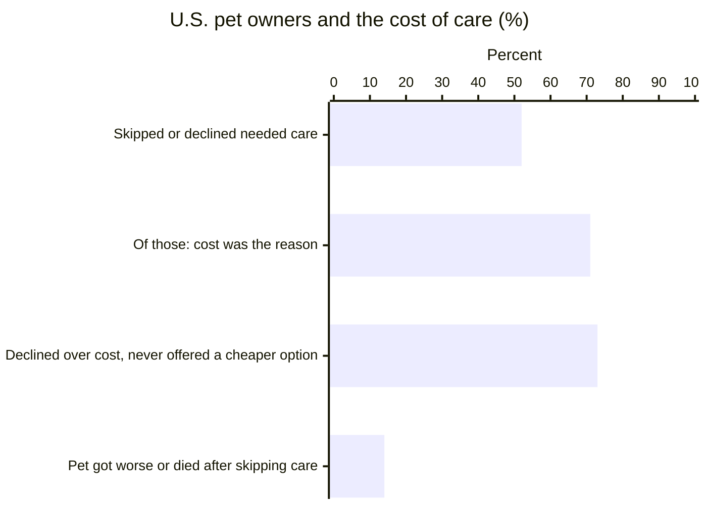

- **52%** of U.S. pet owners skipped or declined vet care their pet needed in the past year.
- **71%** of them say cost was the reason.
- **73%** of those who declined over cost were never offered a lower-cost option.
- **14%** say their pet got worse or died after skipping care.

*Most owners leave with a bill they don't understand, and no one tells them help exists.*

### 1.2. Vets feel it too, and the cost talk comes too late

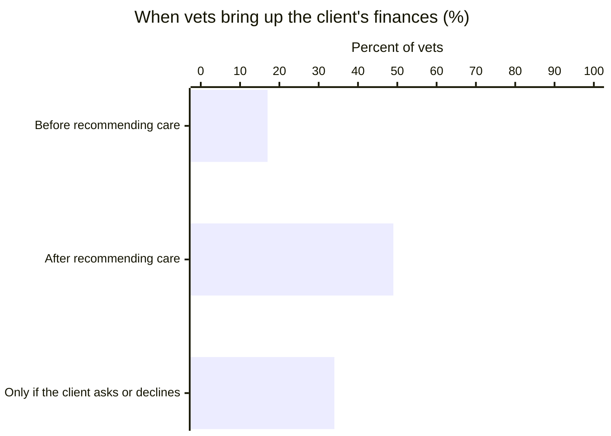

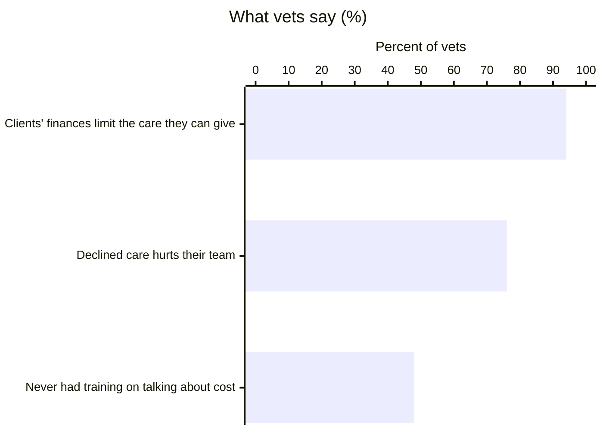

Only **17%** of vets raise cost before recommending care, so the budget usually comes up after the plan is set.

<sub>Sources: Gallup, [52% of U.S. Pet Owners Skipped or Declined Veterinary Care](https://news.gallup.com/poll/659057/pet-owners-skipped-declined-veterinary-care.aspx) (2,498 owners, Nov 2024–Jan 2025) and [Veterinarians Say Cost Is the Main Driver of Declined Care](https://news.gallup.com/poll/700115/veterinarians-say-cost-main-driver-declined-care.aspx) (933 vets, Sep–Oct 2025); PetSmart Charities press releases, [Apr 2025](https://petsmartcharities.org/press-releases/new-study-finds-more-than-half-of-u-s-pet-parents-skip-or-decline-needed-veterinary-care) and [Jan 2026](https://petsmartcharities.org/press-releases/cost-of-care-continues-to-strain-veterinary-care-access-new-study-finds).</sub>

### 1.3. Challenges We're Entering

- **Cost-of-Care Conversation** — turns sticker shock into a shared decision: the vet sees the owner's budget and aid plan before recommending care.
- **Open Venture** — 52% of U.S. pet owners skip needed care, and nothing else connects the owner, the vet, and financial aid.

---

## 2. Major Features

### 2.1. Diagnosis

The owner answers a short check on their phone and gets an urgency level from 1 to 4, conditions the symptoms may relate to, and what a visit costs at nearby clinics.

1. **Dog profile:** name, age, weight, and ZIP code.
2. **Emergency check:** three questions about breathing, collapse or injury, and poisoning. Any "yes / unsure" goes straight to Level 4 emergency help.
3. **Symptoms:** pick from 10 symptom chips and add notes.
4. **Follow-ups:** how long, energy, eating and drinking, and one question specific to the symptom. Red-flag answers jump to Level 4.
5. **Result:** fixed urgency rules set Level 1–3, the health-record datasets suggest related conditions, and prices are read live from clinic websites near the owner's ZIP. Only a price printed on the clinic's own page is shown.

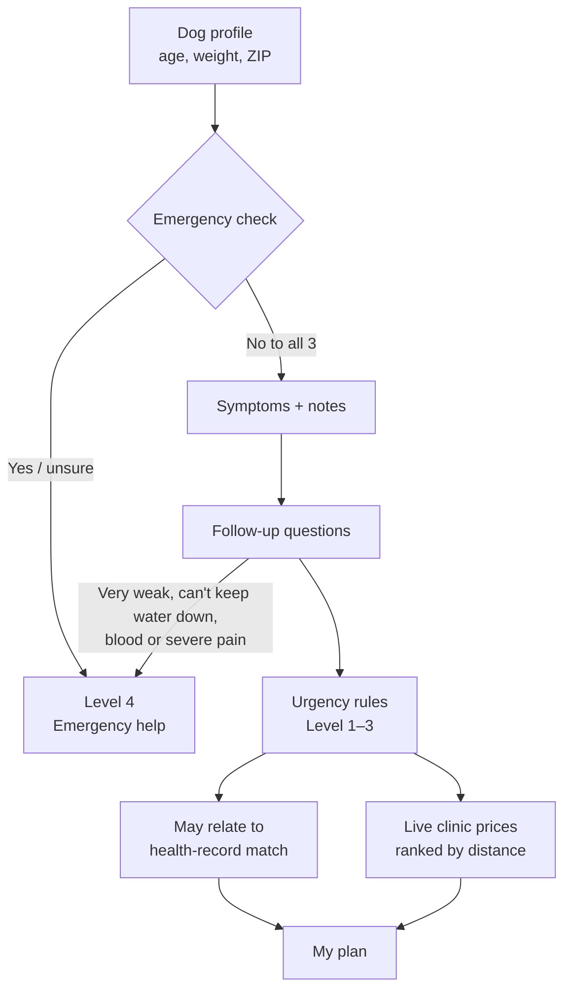

<p align="center">
  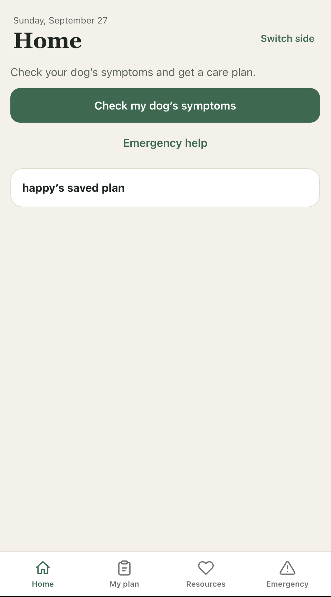
  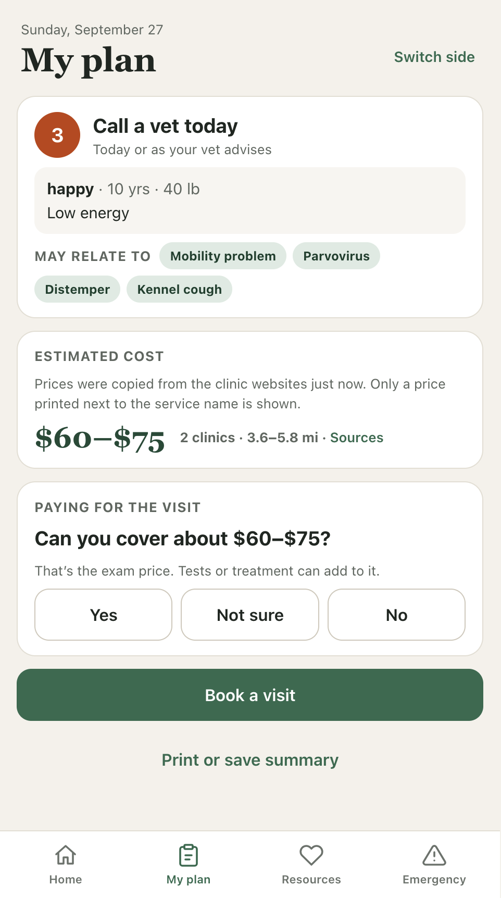
  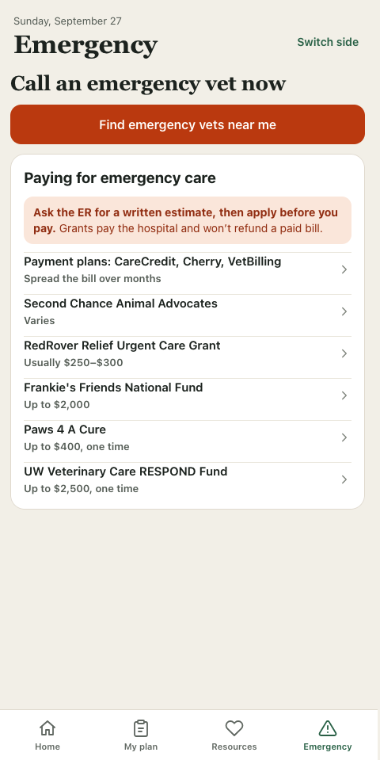
</p>

### 2.2. Financial Aid

Most grants need the vet's diagnosis and written estimate, pay the clinic directly, and never refund a bill already paid. So PawPlan helps the owner plan before the visit and apply before paying.

1. **Can you cover it?** My plan asks "Can you cover about $X?" Yes goes straight to booking.
2. **Three questions:** county (filled in from the ZIP), household income, and budget.
3. **Matching:** 15 Wisconsin and national options are filtered by area, urgency level, income limit, grant cap, and whether the program is open.
4. **Results:** "Use now" (payment plans, reduced-cost clinics) and "Apply after the vet's estimate" (grants), each with fit, amount, timing, and how to apply. Programs that don't apply are listed with the reason.
5. **Shortlist:** the owner saves the programs they'll use. Booking warns when a saved program won't pay a clinic, and the status screen shows a checklist of what to ask the vet for.

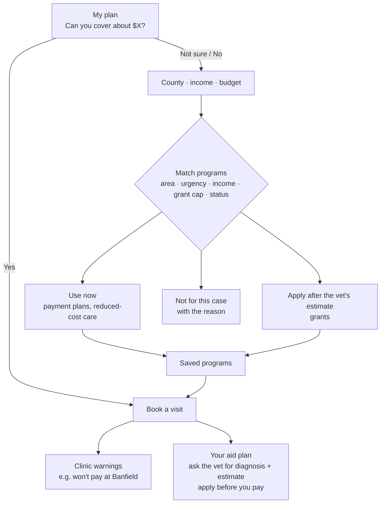

<p align="center">
  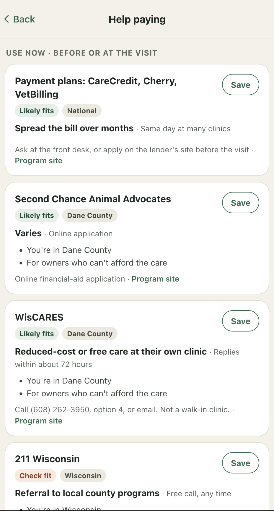
</p>

### 2.3. Appointment Management

Owners book without making an account. The request reaches the vet live with the urgency level, symptoms, budget, and aid plan attached.

1. **Pick a time:** clinics that signed up in the vet app, with open times for the next two weeks. Taken times are hidden, so nothing is double-booked.
2. **Request:** the owner enters a name and phone number; the phone gets a quiet anonymous sign-in and sends the request.
3. **Vet Requests:** the request appears live, with an "On a budget" note when the owner needs help paying. The vet accepts or declines.
4. **Status:** the owner's screen updates by itself: waiting, confirmed, or pick another time.
5. **After accepting:** the visit is on the vet's month/week/day calendar, can be added to Apple Calendar, opens a chat with the owner, and moves the dog to Patients when marked complete.

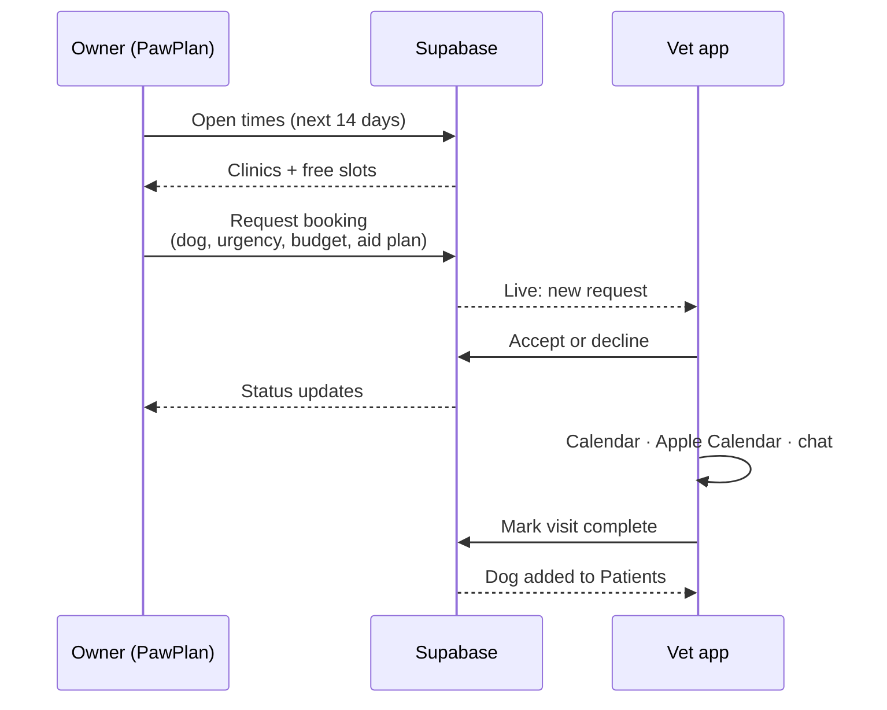

<p align="center">
  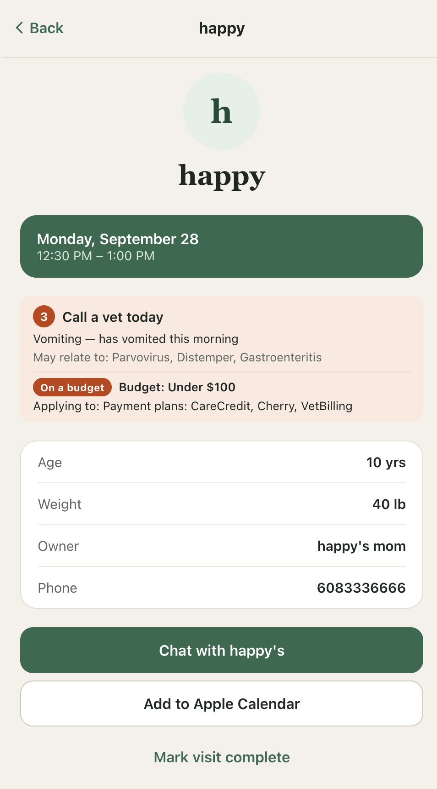
</p>

---

## 3. Project Structure

```text
BadgerBuildFest2026/
|-- apps/
|   |-- vet/                             # Vet app (Vite + React + TypeScript), also serves the owner side
|   |   |-- vite.config.ts               # Port 8081, /owner/ mount, /api/prices, tunnel hosts
|   |   |-- .env.example                 # Supabase URL + publishable key
|   |   `-- src/
|   |       |-- App.tsx                  # Start screen, sign-in gate, routes
|   |       |-- store/                   # Auth.tsx, VetStore.tsx (data + realtime), Side.tsx
|   |       |-- pages/                   # Requests, Appointments, Patients, Chat, details, sign-in, setup
|   |       |-- components/              # Tab layout, toast, shared UI, icons
|   |       |-- lib/                     # Supabase client, dates, .ics calendar export
|   |       `-- types/index.ts           # Dog, Owner, BookingRequest, Patient, Message
|   `-- client/                          # Owner site (PawPlan, static HTML/CSS/JS)
|       |-- app.js                       # Screens, state, booking flow
|       |-- care.js                      # Urgency rules, related conditions, cost estimate, assistance
|       |-- backend.js                   # Supabase REST calls: open slots, request, status, cancel
|       |-- live-prices.mjs              # Reads clinic pages, optional Gemini matching
|       |-- server.mjs                   # Standalone server for the owner site on :8787
|       |-- pricing-data.js              # Wisconsin clinics and published prices
|       |-- pet-symptoms.js              # Owner observations from pet_health_symptoms.xlsx
|       |-- disease-cases.js             # Disease records from dog_disease_prediction.xlsx
|       |-- zip-centroids.js             # Wisconsin ZIP coordinates
|       |-- aid-orgs.js                  # Financial aid programs (from pet_financial_aid_orgs_expanded.xlsx)
|       |-- aid.js                       # Matches owners to aid; clinic warnings; document checklist
|       |-- zip-counties.js              # Wisconsin ZIP → county
|       `-- *.test.js                    # care.test.js, aid.test.js, live-prices.test.js
|-- supabase/migrations/
|   |-- 0001_init.sql                    # Tables, RLS, guard triggers, realtime
|   |-- 0002_open_slots.sql              # Open appointment times, no double-booking
|   `-- 0003_booking_requests.sql        # request_booking function for owners
|-- data/                                # Source spreadsheets
`-- docs/                                # Architecture, setup, hosting, data, PRDs, screenshots, demo QR
```

## 4. Docs

[Architecture](docs/architecture.md) · [Backend setup](docs/backend-setup.md) · [Running and hosting](docs/running-and-hosting.md) · [Data](docs/data.md) · [PRD: owner app](docs/prd-client.md) · [PRD: vet app](docs/prd-vet.md)

## 5. Team

Built at Badger BuildFest 2026 by:

- slee2238@wisc.edu
- tgraser@wisc.edu
- sheo9@wisc.edu
