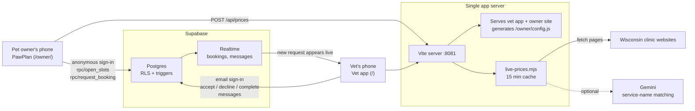
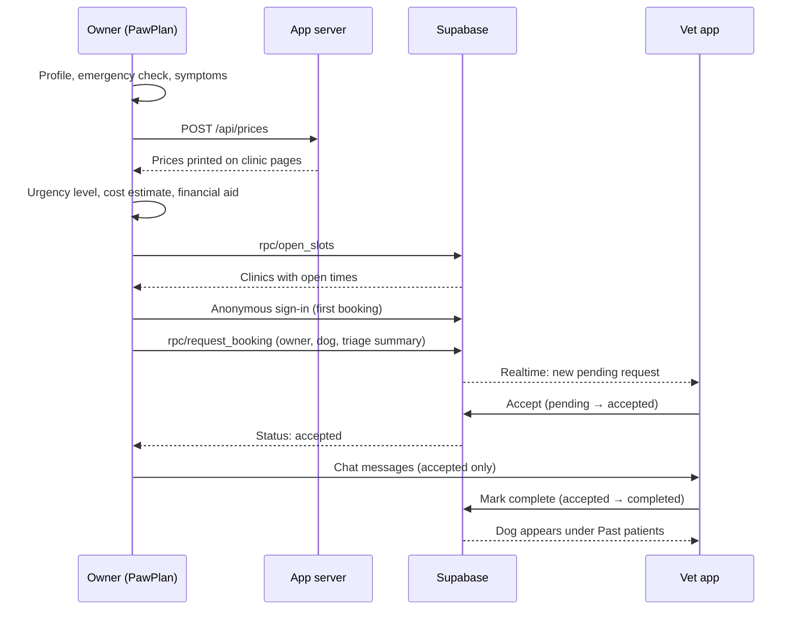

# PetVet


**Track: Health, Sustainability & Society** · Badger BuildFest 2026 (UW–Madison)

Dog owners see how urgent it is, what it costs nearby, and who can help pay, before the visit. Their vet gets the request with the budget attached.

> *"This is a pet healthcare crisis that requires urgent attention."*
> — Aimee Gilbreath, President, PetSmart Charities ([2025](https://petsmartcharities.org/press-releases/new-study-finds-more-than-half-of-u-s-pet-parents-skip-or-decline-needed-veterinary-care))

## Challenges We're Entering

| Challenge | Prizes | What it asks | How PetVet answers it |
|-----------|--------|--------------|-----------------------|
| **Owner-Side Communication & Decision Support: The Cost-of-Care Conversation** | 1st $500 · 2nd $250 | More than half of U.S. pet owners skip or decline recommended care, often over cost. How might you turn the conversation from sticker shock into an informed, shared decision between owner and vet? | The owner sees urgency and published local prices **before** the visit. Their budget and aid plan travel with the booking request, so the vet knows the constraints before recommending care. An "apply before you pay" checklist tells the owner what to ask the vet for. |
| **Open Venture** | 1st $500 · 2nd $250 | Real venture potential: market signal, founder-market fit, differentiation, and a path beyond the weekend. | A $158B U.S. pet industry with a documented care gap; the only flow we found that joins urgency, local price, financial aid, and the vet; a path from Madison independents to Wisconsin to national. See [Open Venture](#open-venture). |

PetVet was built around a simple problem: a dog gets sick, and the owner has no idea how serious it is or what the visit will cost until they are already at the clinic. A single procedure can run from a few hundred to several thousand dollars with no warning. Lower-income owners delay treatment, take on debt, or give up their pet. At the same time, there is no easy way to compare local vets on trust or price, and new vets starting their own practice have no easy way to reach new clients.

| Stat | What it means |
|-----:|---------------|
| **52%** | of U.S. pet owners have skipped or declined needed vet care in the past year |
| **71%** | of those who skipped care say cost was the reason |
| **75M** | U.S. pets may lack access to needed vet care by 2030 |
| **15K** | projected shortage of U.S. veterinarians by 2030 |

<sub>Sources: PetSmart Charities–Gallup State of Pet Care Study, 2025; Banfield Pet Hospital; Mars Veterinary Health workforce projections.</sub>

PetVet puts both sides in one app. The owner side (**PawPlan**) tells an owner how urgent their dog's symptoms are, what the visit is likely to cost, and where to find financial help, then sends a booking request. The vet side receives that request live, along with the triage summary, and gives a solo vet a calendar, a patient history, and a chat with the owner. Both open from one link or QR code in a phone browser, with nothing to install.

## The Problems We're Solving

PetVet is aimed at one moment (an owner deciding whether to get care) where three groups are each missing something:

| Who | The problem | Evidence | What PetVet does |
|-----|-------------|----------|------------------|
| **Pet owners** | They don't know how urgent it is, what it will cost, or that help exists, until they're at the front desk. | 52% skipped or declined needed care; 71% of them because of cost; 73% of those were never offered a lower-cost option; 14% say their pet got worse or died. | Urgency level 1–4, published local prices with sources, and financial aid matched to their county, income, and urgency, all before booking. |
| **Vets, especially new solo practices** | The cost conversation happens too late, and independents compete with chains for new clients. | Only 17% of vets raise finances before recommending care; 94% say clients' finances limit care; 48% had no training on cost conversations. Corporate groups own about 25% of primary-care practices and 50% of U.S. vet revenue. | Booking requests arrive live with the triage summary, the owner's budget, and the aid programs they're applying to, plus a free calendar, patient list, and chat. |
| **Financial aid programs** | Most grants need a diagnosis and written estimate, pay the clinic directly, and never refund a bill already paid. Owners find them too late. | 14 programs reviewed (Sep 26, 2026): RedRover, Frankie's Friends, Paws 4 A Cure, Noah's, Heart2Heart and others all require the vet's estimate first. | Owners shortlist programs before the visit; the app tells them what to ask the vet for and warns when a program won't pay a clinic. |

<sub>Sources: Gallup, [52% of U.S. Pet Owners Skipped or Declined Veterinary Care](https://news.gallup.com/poll/659057/pet-owners-skipped-declined-veterinary-care.aspx) (2025) and [Veterinarians Say Cost Is the Main Driver of Declined Care](https://news.gallup.com/poll/700115/veterinarians-say-cost-main-driver-declined-care.aspx) (2025); [PetSmart Charities](https://petsmartcharities.org/press-releases/cost-of-care-continues-to-strain-veterinary-care-access-new-study-finds) (Jan 2026); [AAHA](https://www.aaha.org/trends-magazine/publications/how-to-compete-in-the-veterinary-corporate-consolidation-race/) citing a 2025 Frontiers in Veterinary Science study; `data/pet_financial_aid_orgs_expanded.xlsx`.</sub>

## Breadth at a Glance

| Dimension | What we built |
|-----------|---------------|
| **Users** | Two sides in one app: pet owners (PawPlan) and vets, joined live through the database |
| **End-to-end flow** | Symptoms → emergency check → urgency 1–4 → related conditions → local published price → financial aid → booking request → vet accept / decline → calendar, patients, chat |
| **Money** | Source-backed clinic prices, a "can you cover this?" check, 15 financial-help options (Wisconsin + national) matched by county, income, urgency, and grant limits |
| **Data** | 424 owner observations, 75 disease records, 15 Wisconsin clinics, 783 ZIP centroids, ZIP → county for all 72 Wisconsin counties, 14 aid organizations checked against their own sites |
| **Backend** | Supabase Postgres with row-level security, guard triggers, realtime, and three migrations (tables, open slots, booking requests) |
| **AI** | Gemini matches clinic service names to prices; every dollar amount must appear on the clinic's own page |
| **Quality** | 18 automated tests across urgency rules, pricing, live-price parsing, and aid matching |
| **Demo** | One server, one link, one QR code for both sides, over a free Cloudflare tunnel |

## Open Venture

| | |
|-|-|
| **Market signal** | U.S. pet industry spending reached $158B in 2025 across 95M pet households ([APPA](https://americanpetproducts.org/news/u.s.-pet-industry-reaches-158-billion-in-2025-poised-for-continued-growth-in-2026)). More than half of owners skip needed care, so demand already exists and goes unmet. |
| **Differentiation** | Symptom checkers, vet price sites, and aid directories each exist separately. None we found connects them, and none sends the owner's budget to the vet before the visit. |
| **Founder-market fit** | A UW–Madison team building with real Madison and Wisconsin clinic prices and aid programs verified against each program's site. |
| **Path beyond the weekend** | Pilot with independent Madison vets → all of Wisconsin → national aid data. Proposed revenue (not yet validated): a vet subscription for pre-triaged booking requests, plus financing referrals. |

## Repository Snapshot

| Area | What is implemented today |
|------|----------------------------|
| Owner app (PawPlan) | Static HTML/CSS/JS site: dog profile, emergency check, symptom questionnaire, 1–4 urgency scale, related conditions, cost estimate, financial aid, booking requests |
| Vet app | React + TypeScript app: email sign-in, practice setup, booking requests, month/week/day calendar, past patients, chat, Apple Calendar export |
| Backend | Supabase Postgres with row-level security, guard triggers, realtime on `bookings` and `messages`, open-slot and booking-request functions |
| Live pricing | `POST /api/prices` reads clinic websites, keeps only prices printed on the page, optionally uses Gemini to match service names |
| Symptom data | 424 dog owner observations and 75 dog disease records used for "May relate to" suggestions |
| Financial aid | **Help paying** screen: 15 Wisconsin + national options matched by county (from ZIP), income, urgency, and grant limits; saved programs travel with the booking; "Your aid plan" checklist; vet sees an "On a budget" note |
| Demo hosting | One Vite server on port `8081` serves both sides; shared to phones through a Cloudflare quick tunnel + QR code |

## Architecture Overview



## Why This Architecture

The project is layered so each side can be built and demoed on its own, then joined through the database:

1. **The owner side works as a static site.** Triage rules, symptom matching, and financial aid all run in the browser from plain JS modules, so the core flow works even before the backend exists.
2. **The vet side is a React app backed by Supabase.** Every screen is driven by `bookings.status`, and Realtime pushes new requests and messages without refreshing.
3. **The database enforces the rules, not the app.** Row-level security and triggers decide who can see what, which status changes are allowed, and which time slots are open, so neither client can break the workflow.
4. **One server serves both sides.** A small Vite plugin mounts the owner site at `/owner/`, shares the Supabase settings with it, and hosts the price endpoint, so the whole demo runs from one link and one QR code.

The only server-side code is the price reader, which keeps the optional Gemini key off of phones.

## How It Works: Pet Owners

| Step | Screen | What happens |
|-----:|--------|--------------|
| 1 | Create a profile | Dog's name, age, weight, and ZIP code. Saved in the browser; **Delete saved data** clears it. |
| 2 | Emergency check | Serious signs go straight to Level 4 with emergency guidance. |
| 3 | Describe symptoms | Pick from 10 symptom chips, then answer follow-ups on duration, energy, eating/drinking, and a symptom-specific detail. |
| 4 | See urgency & price | Urgency level shown next to the full 1–4 scale, "May relate to" conditions, a cost estimate with sources, and questions to ask the vet. |
| 5 | Help paying | "Can you cover about $X?" If not: county, income, and budget → programs to use now vs. apply after the vet's estimate, with fit, amount, and timing. Save the ones you'll use. |
| 6 | Book a vet | Pick a clinic and an open time, enter name and phone, and send the request with the triage summary attached. Status updates and cancel are available after sending. |

## How It Works: Vets

| Step | Screen | What happens |
|-----:|--------|--------------|
| 1 | Sign in | Email and password; first sign-in asks for name, clinic, and city. |
| 2 | Requests | Incoming booking requests with the dog's info, triage summary, and the owner's budget and aid plan; accept or decline each one. |
| 3 | Appointments | Month, week, and day calendar views; add any visit to Apple Calendar (`.ics`). |
| 4 | Patients | Dogs with completed visits and their visit history. |
| 5 | Chat | Talk with the owner about symptoms, only while the appointment is accepted. |

## Urgency Levels

| Level | Title | Timing | Triggered by |
|------:|-------|--------|--------------|
| 1 | Keep a close eye | Monitor and call if concerned | Mild, recent symptoms with normal answers |
| 2 | Plan a vet visit | Within the next few days | Mild illness that is not getting worse |
| 3 | Call a vet today | Today or as your vet advises | Follow-up answers that say the dog is worse |
| 4 | Get emergency help | Contact an emergency vet now | Severe lethargy, unable to eat or drink, or a red-flag sign |

## Booking Lifecycle



`bookings.status` drives every screen:

| Status | Shown on |
|--------|----------|
| `pending` | Vet: Requests |
| `accepted` | Vet: Appointments, Chat |
| `declined` | Owner is notified |
| `completed` | Vet: Past patients |
| `cancelled` | Owner cancelled |

## Tech Stack

| Layer | Technology | Why it is used |
|------|------------|----------------|
| Vet UI | React 19 + TypeScript + React Router | Typed screens and routes for the four-tab vet app |
| Owner UI | Plain HTML/CSS/JS modules | Fast, dependency-free phone site that works without a build step |
| Build / dev server | Vite | Hot reload, serves both sides on one port, preview build for demos |
| Styling | Plain CSS | Phone-width layouts with no UI library |
| Database | Supabase Postgres | Tables, row-level security, triggers, and RPC functions |
| Auth | Supabase Auth | Email + password for vets; anonymous sign-in for owners |
| Live updates | Supabase Realtime | New requests and chat messages appear without refreshing |
| Price matching | Gemini (optional) | Matches clinic service names; amounts must still appear on the page |
| Demo hosting | Cloudflare quick tunnel | Free public link for phones on campus Wi-Fi, shared by QR code |

## Key Design Decisions

| Decision | Why | Alternative |
|----------|-----|-------------|
| Mobile-first web app instead of native | Anyone opens it from a link or QR code with nothing to install | iOS / Android apps |
| Owner side as a static site | Core triage works in the browser and can be built in parallel with the backend | Second React app from day one |
| Rules enforced in the database | RLS and triggers protect data and status changes no matter what a client sends | Checks only in app code |
| Anonymous owner sign-in | Owners only type a name and phone number to book | Full owner accounts |
| Price must be printed on the clinic page | No invented dollar amounts; a model can match a name but not make up a price | Let the model estimate prices |
| No fallback to stored dollars | If clinic sites can't be read, the plan shows no amount instead of stale numbers | Fall back to a cached catalog |
| Rule-based urgency, not a black box | Levels are explainable and testable; mild illnesses stay at Level 1–2 unless follow-ups say otherwise | Model-only triage |
| One server for both sides | One link, one QR code, one tunnel for the demo | Two separately hosted apps |
| Publishable key committed in `apps/vet/.env` | Teammates can run right after cloning; access rules protect the data | Every teammate sets up keys by hand |

## Current Scope

The strongest end-to-end path in this repository is:

- Owner profile → emergency check → symptom questionnaire → 1–4 urgency level
- "May relate to" conditions from the owner-observation and disease datasets
- Live, source-backed clinic prices read at request time
- Financial aid matched to the owner and carried to the vet with the booking
- Booking request from the owner side that appears live on the vet's Requests screen
- Vet accept / decline, calendar, patients, and chat backed by Supabase

A few edges are scaffolded for future work:

- The stored Wisconsin price catalog in `pricing-data.js` (15 clinics) is disconnected from the estimate while it moves into the database. The live price reader still uses its clinic list.
- Owner-side chat with the vet is planned; chat currently works from the vet side.
- The AI triage Edge Function (`supabase/functions/triage/`) is not started; urgency is rule-based in `care.js`.
- Owners are dog owners only. Cats and other animals, payments, and real clinic integrations are out of scope for the hackathon.

## Data In This Repo

| File | Contents | Used for |
|------|----------|----------|
| `data/pet_health_symptoms.xlsx` | 2,000 rows; 424 dog and puppy owner observations with a condition label | Matching symptom chips to related conditions (`pet-symptoms.js`) |
| `data/dog_disease_prediction.xlsx` | 75 dogs with up to four symptoms and a predicted disease | "May relate to" disease suggestions (`disease-cases.js`) |
| `apps/client/pricing-data.js` | 15 Wisconsin clinics with published prices, sources, and coordinates (accessed 2026-09-26) | Clinic list for live prices; stored catalog (disconnected) |
| `apps/client/zip-centroids.js` | 783 Wisconsin ZIP centroids (Census 2024 Gazetteer) | Ranking clinics by distance from the owner's ZIP |
| `data/pet_financial_aid_orgs_expanded.xlsx` | 14 Wisconsin and national aid organizations, checked against each org's site (Sep 26, 2026) | `aid-orgs.js`, the Help paying screen |
| `apps/client/zip-counties.js` | Wisconsin ZIP → county for all 72 counties (Census crosswalk) | Matching county-limited aid programs |

The datasets give condition labels only. They contain no prices, and PawPlan never presents a related condition as a diagnosis.

## Project Structure

```text
BadgerBuildFest2026/
|-- apps/
|   |-- vet/                             # Vet app (Vite + React + TypeScript), also serves the owner side
|   |   |-- vite.config.ts               # Port 8081, /owner/ mount, /api/prices, tunnel hosts
|   |   |-- .env.example                 # Supabase URL + publishable key
|   |   `-- src/
|   |       |-- App.tsx                  # Start screen, sign-in gate, routes
|   |       |-- store/                   # Auth.tsx, VetStore.tsx (data + realtime), Side.tsx
|   |       |-- pages/                   # Requests, Appointments, Patients, Chat, details, sign-in, setup
|   |       |-- components/              # Tab layout, toast, shared UI, icons
|   |       |-- lib/                     # Supabase client, dates, .ics calendar export
|   |       `-- types/index.ts           # Dog, Owner, BookingRequest, Patient, Message
|   `-- client/                          # Owner site (PawPlan, static HTML/CSS/JS)
|       |-- app.js                       # Screens, state, booking flow
|       |-- care.js                      # Urgency rules, related conditions, cost estimate, assistance
|       |-- backend.js                   # Supabase REST calls: open slots, request, status, cancel
|       |-- live-prices.mjs              # Reads clinic pages, optional Gemini matching
|       |-- server.mjs                   # Standalone server for the owner site on :8787
|       |-- pricing-data.js              # Wisconsin clinics and published prices
|       |-- pet-symptoms.js              # Owner observations from pet_health_symptoms.xlsx
|       |-- disease-cases.js             # Disease records from dog_disease_prediction.xlsx
|       |-- zip-centroids.js             # Wisconsin ZIP coordinates
|       |-- aid-orgs.js                  # Financial aid programs (from pet_financial_aid_orgs_expanded.xlsx)
|       |-- aid.js                       # Matches owners to aid; clinic warnings; document checklist
|       |-- zip-counties.js              # Wisconsin ZIP → county
|       `-- *.test.js                    # care.test.js, aid.test.js, live-prices.test.js
|-- supabase/migrations/
|   |-- 0001_init.sql                    # Tables, RLS, guard triggers, realtime
|   |-- 0002_open_slots.sql              # Open appointment times, no double-booking
|   `-- 0003_booking_requests.sql        # request_booking function for owners
|-- data/                                # Source spreadsheets
`-- docs/                                # Architecture, setup, hosting, data, PRDs
```

## Getting Started

### Requirements

- Node.js **20.19 or newer**
- A Supabase project (free tier works)
- Optional: a free Gemini API key from Google AI Studio

### 1. Set up Supabase (once per team)

Full walkthrough: [docs/backend-setup.md](docs/backend-setup.md).

1. Create a Supabase project and copy the **Project URL** and **publishable key**.
2. In **SQL Editor**, run `0001_init.sql`, `0002_open_slots.sql`, and `0003_booking_requests.sql` in order.
3. Under **Authentication → Sign In / Providers**, turn on **Allow anonymous sign-ins** and turn off **Confirm email**.

### 2. Configure environment

```bash
cp apps/vet/.env.example apps/vet/.env          # VITE_SUPABASE_URL, VITE_SUPABASE_KEY
cp apps/client/.env.example apps/client/.env    # GEMINI_API_KEY (optional)
```

Never put the Supabase secret / `service_role` key in either file. The Gemini key stays on the server and `apps/client/.env` is git-ignored.

### 3. Run

```bash
cd apps/vet
npm install
npm run dev        # http://localhost:8081
```

- Start screen: choose **Pet owner** or **Vet**
- Owner side: `http://localhost:8081/owner/`
- Vet side: create an account, then set up your practice
- For a faster demo build: `npm run build` then `npm run serve`

To run only the owner site: `node apps/client/server.mjs` (serves on `http://127.0.0.1:8787`).

### 4. Share with phones

Campus Wi-Fi blocks phones from reaching a laptop directly, so the demo uses a free Cloudflare quick tunnel:

```bash
./cloudflared tunnel --url http://localhost:8081
npx qrcode-terminal https://<your-words>.trycloudflare.com
```

Keep the dev server and tunnel running, and the laptop awake. Details and troubleshooting: [docs/running-and-hosting.md](docs/running-and-hosting.md).

## Testing

Automated tests cover the owner-side logic:

- urgency levels for mild, worsening, and red-flag answers
- the printed summary naming the result and every level
- real links for every assistance program
- related-condition suggestions from the health records
- cost totals that only use published amounts
- live page text keeping a printed price and dropping an invented one
- aid matching by county, income, urgency, and grant limits; clinic warnings; the document checklist

```bash
cd apps/client
node --test care.test.js aid.test.js live-prices.test.js
```

Three pricing tests are skipped while the stored prices in `pricing-data.js` are disconnected.

## Documentation

- [Architecture](docs/architecture.md)
- [Backend setup](docs/backend-setup.md)
- [Running and hosting](docs/running-and-hosting.md)
- [Triage dataset](docs/data.md)
- [PRD: pet owner app](docs/prd-client.md)
- [PRD: vet app](docs/prd-vet.md)

## Why This Project Is Interesting

PetVet is not just "a vet booking app." The interesting part is how it puts cost and trust into the moment an owner decides whether to get care:

- It gives an urgency level **and** a price before the visit, not after.
- It refuses to show a dollar amount it can't trace to a clinic's own page.
- It surfaces real local financial aid inside the booking flow, not on a separate page.
- It gives solo vets a working practice tool on day one: requests, calendar, patients, and chat.
- It pushes the hard rules (privacy, status changes, double-booking) into the database, so both sides stay honest.

That combination makes it part triage tool, part pricing-transparency experiment, and part two-sided marketplace for the vets who need new clients most.

## Team

Built at Badger BuildFest 2026 by:

- slee2238@wisc.edu
- tgraser@wisc.edu
- sheo9@wisc.edu
